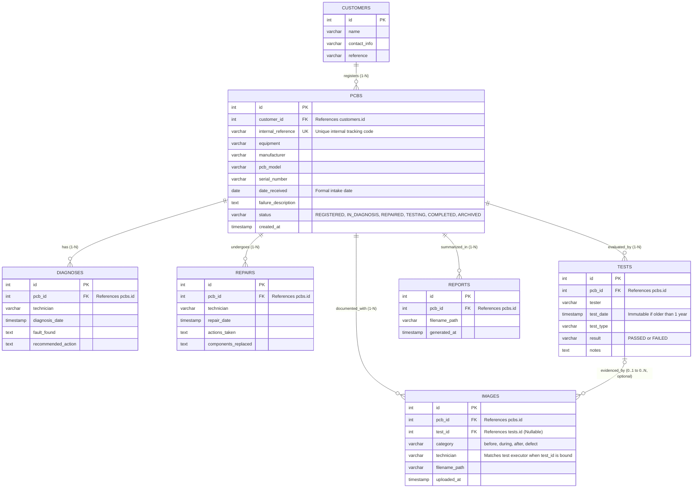

# GreenUp LIS — Database Schema & Data Dictionary

## 1. Overview & Architecture
This document defines the relational database architecture for the **GreenUp Laboratory Information System (LIS)**. The database is hosted on **PostgreSQL** and follows a normalized 1-to-Many entity relationship model matching the backend service implementation and ER specifications.

Key business rules enforced at the database and API layer include:
* **1-Year Immutability Policy:** Test verification records older than 365 days are immutable (`🔒 Locked`) for laboratory auditing integrity.
* **Re-Intake Lifecycle:** Recurring equipment preserves historical service cycles under distinct primary keys and internal tracking references while maintaining serial number traceability.
* **Flexible Visual Evidence:** Inspection images can be associated with specific test verification steps (`test_id FK`) or logged as general visual inspections (`test_id NULL`).

---

## 2. Entity-Relationship (ER) Diagram



## 3. Data Dictionary (PostgreSQL DDL Code)

```sql
-- 1. Customers Table
CREATE TABLE customers (
    id SERIAL PRIMARY KEY,
    name VARCHAR(150) NOT NULL,
    contact_info VARCHAR(150),
    reference VARCHAR(100)
);

-- 2. PCBs Core Table
CREATE TABLE pcbs (
    id SERIAL PRIMARY KEY,
    customer_id INTEGER NOT NULL REFERENCES customers(id) ON DELETE RESTRICT,
    internal_reference VARCHAR(50) UNIQUE NOT NULL,
    equipment VARCHAR(100) NOT NULL,
    manufacturer VARCHAR(100),
    pcb_model VARCHAR(100),
    serial_number VARCHAR(100),
    date_received DATE NOT NULL DEFAULT CURRENT_DATE,
    failure_description TEXT NOT NULL,
    status VARCHAR(30) NOT NULL DEFAULT 'REGISTERED' 
        CHECK (status IN ('REGISTERED', 'IN_DIAGNOSIS', 'REPAIRED', 'TESTING', 'COMPLETED', 'ARCHIVED')),
    created_at TIMESTAMP NOT NULL DEFAULT NOW()
);

-- 3. Diagnoses Table
CREATE TABLE diagnoses (
    id SERIAL PRIMARY KEY,
    pcb_id INTEGER NOT NULL REFERENCES pcbs(id) ON DELETE CASCADE,
    technician VARCHAR(100),
    diagnosis_date TIMESTAMP NOT NULL DEFAULT NOW(),
    fault_found TEXT NOT NULL,
    recommended_action TEXT
);

-- 4. Repairs Table
CREATE TABLE repairs (
    id SERIAL PRIMARY KEY,
    pcb_id INTEGER NOT NULL REFERENCES pcbs(id) ON DELETE CASCADE,
    technician VARCHAR(100),
    repair_date TIMESTAMP NOT NULL DEFAULT NOW(),
    actions_taken TEXT NOT NULL,
    components_replaced TEXT
);

-- 5. Tests Table
CREATE TABLE tests (
    id SERIAL PRIMARY KEY,
    pcb_id INTEGER NOT NULL REFERENCES pcbs(id) ON DELETE CASCADE,
    tester VARCHAR(100),
    test_date TIMESTAMP NOT NULL DEFAULT NOW(),
    test_type VARCHAR(100),
    result VARCHAR(20) NOT NULL CHECK (result IN ('PASSED', 'FAILED')),
    notes TEXT
);

-- 6. Images Metadata Table
CREATE TABLE images (
    id SERIAL PRIMARY KEY,
    pcb_id INTEGER NOT NULL REFERENCES pcbs(id) ON DELETE CASCADE,
    test_id INTEGER REFERENCES tests(id) ON DELETE SET NULL,
    category VARCHAR(50) NOT NULL DEFAULT 'before'
        CHECK (category IN ('before', 'during', 'after', 'defect')),
    technician VARCHAR(100),
    filename_path VARCHAR(255) NOT NULL,
    uploaded_at TIMESTAMP NOT NULL DEFAULT NOW()
);

-- 7. Reports Table
CREATE TABLE reports (
    id SERIAL PRIMARY KEY,
    pcb_id INTEGER NOT NULL REFERENCES pcbs(id) ON DELETE CASCADE,
    filename_path VARCHAR(255) NOT NULL,
    generated_at TIMESTAMP NOT NULL DEFAULT NOW()
);

-- Indices for Foreign Keys and Query Performance
CREATE INDEX idx_pcbs_customer_id ON pcbs(customer_id);
CREATE INDEX idx_diagnoses_pcb_id ON diagnoses(pcb_id);
CREATE INDEX idx_repairs_pcb_id ON repairs(pcb_id);
CREATE INDEX idx_tests_pcb_id ON tests(pcb_id);
CREATE INDEX idx_images_pcb_id ON images(pcb_id);
CREATE INDEX idx_images_test_id ON images(test_id);
CREATE INDEX idx_reports_pcb_id ON reports(pcb_id);
```

## 4. Sample Data Walkthrough (SQL Insert Script)

```sql
-- Step 1: Register Customer
INSERT INTO customers (id, name, contact_info, reference)
VALUES (1, 'IPCB Electronics Lab', 'lab@ipcb.pt', 'REF-IPCB-2026');

-- Step 2: Receive & Register PCB (Initial Intake)
INSERT INTO pcbs (id, customer_id, internal_reference, equipment, manufacturer, pcb_model, serial_number, date_received, failure_description, status)
VALUES (1, 1, 'PCB-2026-001', 'Solar Inverter Board', 'Schneider', 'INV-500', 'SN987654', '2026-08-27', 'Unit does not power up; input fuse blown.', 'REGISTERED');

-- Step 3: Add Diagnosis
INSERT INTO diagnoses (id, pcb_id, technician, diagnosis_date, fault_found, recommended_action)
VALUES (1, 1, 'Sema', '2026-08-27 11:00:00', 'D4 diode shorted to GND, C12 capacitor bulging.', 'Replace shorted diode and capacitor.');

-- Step 4: Add Repair
INSERT INTO repairs (id, pcb_id, technician, repair_date, actions_taken, components_replaced)
VALUES (1, 1, 'Sema', '2026-08-27 14:30:00', 'Replaced shorted diode and capacitor; cleaned PCB flux residue.', '1x 1N4007, 1x 100uF 50V Low-ESR');

-- Step 5: Add Test Verification
INSERT INTO tests (id, pcb_id, tester, test_date, test_type, result, notes)
VALUES (1, 1, 'Sema', '2026-08-27 16:00:00', 'Functional & Power Rail Test', 'PASSED', 'Input: 24.0V DC, Output: 5.01V DC regulated.');

-- Step 6: Attach Intake Image (General - test_id IS NULL)
INSERT INTO images (id, pcb_id, test_id, category, technician, filename_path, uploaded_at)
VALUES (1, 1, NULL, 'before', 'Sema', 'uploads/images/pcb_1_intake.jpg', '2026-08-27 10:15:00');

-- Step 7: Attach Verification Image (Tied directly to Test #1)
INSERT INTO images (id, pcb_id, test_id, category, technician, filename_path, uploaded_at)
VALUES (2, 1, 1, 'after', 'Sema', 'uploads/images/pcb_1_test_output.jpg', '2026-08-27 16:15:00');

-- Step 8: Generate Service Report
INSERT INTO reports (id, pcb_id, filename_path, generated_at)
VALUES (1, 1, 'uploads/reports/PCB-2026-001_Final_Report.pdf', '2026-08-27 16:30:00');
```
