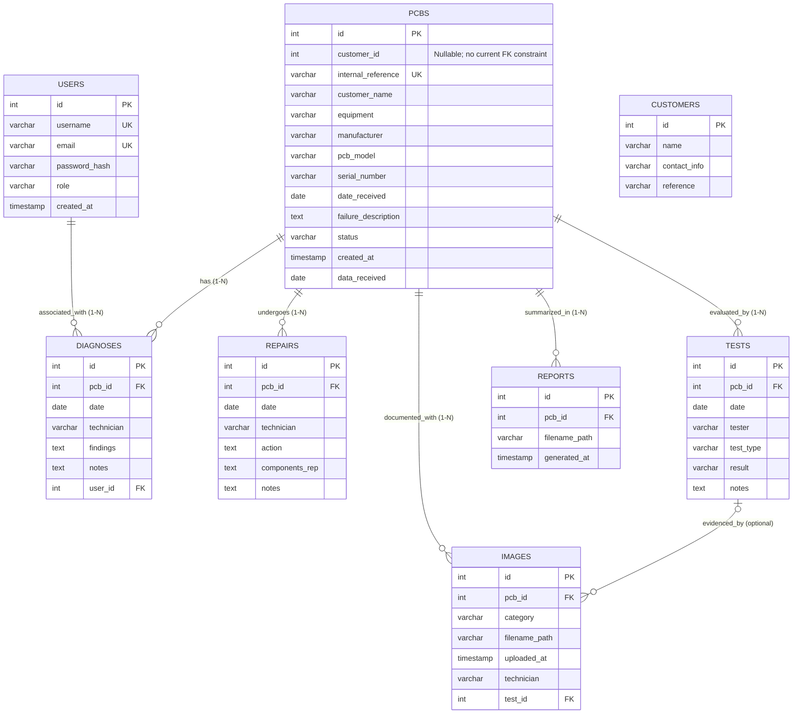

# GreenUp LIS — Database Schema & Data Dictionary (With Users & Authentication)

## 1. Overview & Architecture

GreenUp LIS uses a PostgreSQL relational database to manage the complete lifecycle of PCB service records, including intake, diagnosis, repair, testing, image documentation, reporting, and user authentication.

The database follows a normalized 1-to-Many relational structure:

- One PCB can have multiple diagnoses.
- One PCB can have multiple repairs.
- One PCB can have multiple tests.
- One PCB can have multiple images.
- One PCB can have multiple reports.
- One test can have multiple associated images.
- A diagnosis can optionally be associated with a system user.
- Customers are stored separately; however, `pcbs.customer_id` currently has no database-level foreign key constraint to `customers.id`.

The authentication structure is implemented through the `users` table:

- `username` is unique.
- `email` is unique.
- Passwords are stored as `password_hash`.
- User roles are stored in `role`.
- Diagnosis records can optionally reference the user who created or performed the diagnosis through `diagnoses.user_id`.

### PCB Re-Intake and Traceability

The `pcbs` table represents individual service records rather than permanently unique physical boards. Therefore, the same `serial_number` may appear in multiple PCB records when equipment is returned for another service cycle.

The unique identifier for each service record is `pcbs.id`, while `internal_reference` provides a unique operational reference.

### Historical Testing

Historical test handling is implemented at the application level. The system can evaluate previous test dates, including rules such as identifying tests older than 365 days.

This business rule is not enforced through a database-level immutability constraint.

### Image Documentation

Images belong to a PCB through `images.pcb_id`.

An image may additionally reference a specific test through `images.test_id`. Because this relationship is optional, general PCB images can exist without being associated with a particular test.

### Data and Referential Integrity

The following database-level foreign keys are currently enforced:

- `diagnoses.pcb_id` → `pcbs.id` with `ON DELETE CASCADE`
- `diagnoses.user_id` → `users.id` with `ON DELETE SET NULL`
- `repairs.pcb_id` → `pcbs.id` with `ON DELETE CASCADE`
- `tests.pcb_id` → `pcbs.id` with `ON DELETE CASCADE`
- `images.pcb_id` → `pcbs.id` with `ON DELETE CASCADE`
- `images.test_id` → `tests.id` with `ON DELETE SET NULL`
- `reports.pcb_id` → `pcbs.id` with `ON DELETE CASCADE`

There is currently no foreign key constraint from `pcbs.customer_id` to `customers.id`.

---

## 2. Entity-Relationship (ER) Diagram



## 3. Data Dictionary (PostgreSQL DDL Code)

```sql
-- 1. Users Table
CREATE TABLE users (
    id SERIAL PRIMARY KEY,
    username VARCHAR(100) NOT NULL UNIQUE,
    email VARCHAR(200) NOT NULL UNIQUE,
    password_hash VARCHAR(255) NOT NULL,
    role VARCHAR(50) NOT NULL,
    created_at TIMESTAMP NOT NULL DEFAULT CURRENT_TIMESTAMP
);

-- 2. Customers Table
CREATE TABLE customers (
    id SERIAL PRIMARY KEY,
    name VARCHAR(200) NOT NULL,
    contact_info VARCHAR(200),
    reference VARCHAR(100)
);

-- 3. PCBs Table
CREATE TABLE pcbs (
    id SERIAL PRIMARY KEY,
    internal_reference VARCHAR(50) NOT NULL UNIQUE,
    customer_name VARCHAR(200),
    equipment VARCHAR(200) NOT NULL,
    manufacturer VARCHAR(200),
    pcb_model VARCHAR(200),
    serial_number VARCHAR(200),
    date_received DATE NOT NULL,
    failure_description TEXT,
    status VARCHAR(50) NOT NULL,
    created_at TIMESTAMP NOT NULL,
    customer_id INTEGER,
    data_received DATE DEFAULT CURRENT_DATE
);

-- 4. Diagnoses Table
CREATE TABLE diagnoses (
    id SERIAL PRIMARY KEY,
    pcb_id INTEGER NOT NULL,
    date DATE NOT NULL,
    technician VARCHAR(100),
    findings TEXT NOT NULL,
    notes TEXT,
    user_id INTEGER,

    CONSTRAINT fk_diagnoses_pcb
        FOREIGN KEY (pcb_id)
        REFERENCES pcbs(id)
        ON DELETE CASCADE,

    CONSTRAINT fk_diagnoses_user
        FOREIGN KEY (user_id)
        REFERENCES users(id)
        ON DELETE SET NULL
);


-- 5. Repairs Table
CREATE TABLE repairs (
    id SERIAL PRIMARY KEY,
    pcb_id INTEGER NOT NULL,
    date DATE NOT NULL,
    technician VARCHAR(100),
    action TEXT NOT NULL,
    components_rep TEXT,
    notes TEXT,

    CONSTRAINT fk_repairs_pcb
        FOREIGN KEY (pcb_id)
        REFERENCES pcbs(id)
        ON DELETE CASCADE
);

-- 6. Tests Table
CREATE TABLE tests (
    id SERIAL PRIMARY KEY,
    pcb_id INTEGER NOT NULL,
    date DATE NOT NULL,
    tester VARCHAR(100) NOT NULL,
    test_type VARCHAR(100),
    result VARCHAR(50) NOT NULL,
    notes TEXT,

    CONSTRAINT fk_tests_pcb
        FOREIGN KEY (pcb_id)
        REFERENCES pcbs(id)
        ON DELETE CASCADE
);

-- 7. Images Table
CREATE TABLE images (
    id SERIAL PRIMARY KEY,
    pcb_id INTEGER NOT NULL,
    category VARCHAR(50) NOT NULL,
    filename_path VARCHAR(255) NOT NULL,
    uploaded_at TIMESTAMP NOT NULL,
    technician VARCHAR(100) DEFAULT 'Technician',
    test_id INTEGER,

    CONSTRAINT fk_images_pcb
        FOREIGN KEY (pcb_id)
        REFERENCES pcbs(id)
        ON DELETE CASCADE,

    CONSTRAINT fk_images_test
        FOREIGN KEY (test_id)
        REFERENCES tests(id)
        ON DELETE SET NULL
);

-- 8. Reports Table
CREATE TABLE reports (
    id SERIAL PRIMARY KEY,
    pcb_id INTEGER NOT NULL,
    filename_path VARCHAR(255) NOT NULL,
    generated_at TIMESTAMP NOT NULL DEFAULT CURRENT_TIMESTAMP,

    CONSTRAINT fk_reports_pcb
        FOREIGN KEY (pcb_id)
        REFERENCES pcbs(id)
        ON DELETE CASCADE
);

-- Indices for Foreign Keys and Query Performance

-- PCB customer lookup
CREATE INDEX idx_pcbs_customer_id
    ON pcbs(customer_id);

-- Diagnosis lookups
CREATE INDEX idx_diagnoses_pcb_id
    ON diagnoses(pcb_id);

CREATE INDEX idx_diagnoses_user_id
    ON diagnoses(user_id);

-- Repair lookups
CREATE INDEX idx_repairs_pcb_id
    ON repairs(pcb_id);

-- Test lookups
CREATE INDEX idx_tests_pcb_id
    ON tests(pcb_id);

-- Image lookups
CREATE INDEX idx_images_pcb_id
    ON images(pcb_id);

CREATE INDEX idx_images_test_id
    ON images(test_id);

-- Report lookups
CREATE INDEX idx_reports_pcb_id
    ON reports(pcb_id);
```

## 4. Sample Data Walkthrough (SQL Insert Script)

```sql
-- Step 0 — Create a User
INSERT INTO users (id, username, email, password_hash, role) VALUES (1, 'testuser', 'testuser@example.com', '$2b$12$example_hash', 'user');

-- Step 1 — Create a Customer
INSERT INTO customers (id, name, contact_info, reference) VALUES (1, 'Example Customer', 'customer@example.com', 'CUST-001');

-- Step 2 — Register the PCB
INSERT INTO pcbs (id, internal_reference, customer_name, equipment, manufacturer, pcb_model, serial_number, date_received, failure_description, status, created_at, customer_id, data_received) VALUES (1, 'PCB-2026-0001', 'Example Customer', 'Industrial Controller', 'Example Manufacturer', 'CTRL-100', 'SN-2026-001', '2026-09-01', 'Device does not power on', 'Received', CURRENT_TIMESTAMP, 1, CURRENT_DATE);

-- Step 3 — Add a Diagnosis
INSERT INTO diagnoses (id, pcb_id, date, technician, findings, notes, user_id) VALUES (1, 1, '2026-09-02', 'Technician A', 'Power supply section failure detected', 'Further repair required', 1);

-- Step 4 — Record the Repair
INSERT INTO repairs (id, pcb_id, date, technician, action, components_rep, notes) VALUES (1, 1, '2026-09-03', 'Technician A', 'Replaced damaged power components', 'MOSFET, capacitor', 'PCB powered on after repair');

-- Step 5 — Perform a Test
INSERT INTO tests (id, pcb_id, date, tester, test_type, result, notes) VALUES (1, 1, '2026-09-04', 'Technician A', 'Functional Test', 'PASS', 'All required functions verified');

-- Step 6 — Add a General PCB Image
INSERT INTO images (id, pcb_id, category, filename_path, uploaded_at, technician, test_id) VALUES (1, 1, 'PCB Before Repair', '/uploads/pcb_before.jpg', CURRENT_TIMESTAMP, 'Technician A', NULL);

-- Step 7 — Add Test Evidence Image
INSERT INTO images (id, pcb_id, category, filename_path, uploaded_at, technician, test_id) VALUES (2, 1, 'Test Evidence', '/uploads/test_1.jpg', CURRENT_TIMESTAMP, 'Technician A', 1);

-- Step 8 — Generate a Report
INSERT INTO reports (id, pcb_id, filename_path, generated_at) VALUES (1, 1, '/reports/PCB-2026-0001.pdf', CURRENT_TIMESTAMP);
```
