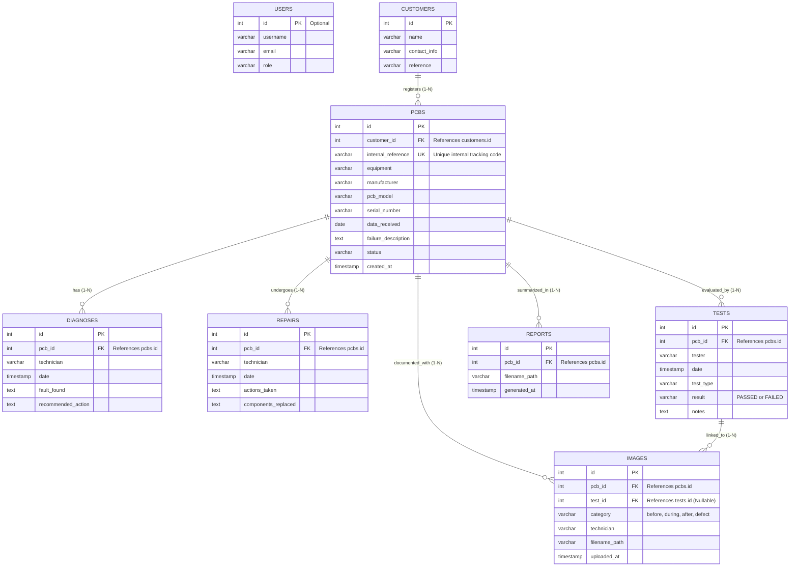

# GreenUp LIS — Database Schema & Data Dictionary (Week 2)

## 1. Overview & Architecture
This document defines the relational database architecture for the **GreenUp Laboratory Information System (LIS)**. The database is hosted on **PostgreSQL** and follows a normalized 1-to-Many entity relationship model matching the approved Week 2 ER Diagram.

---

## 2. Entity-Relationship (ER) Diagram



## 3. Data Dictionary (PostgreSQL DDL Code)

```sql
-- 1. Optional Users Table
CREATE TABLE users (
    id SERIAL PRIMARY KEY,
    username VARCHAR(100) UNIQUE NOT NULL,
    email VARCHAR(150) UNIQUE NOT NULL,
    role VARCHAR(50) NOT NULL
);

-- 2. Customers Table
CREATE TABLE customers (
    id SERIAL PRIMARY KEY,
    name VARCHAR(150) NOT NULL,
    contact_info VARCHAR(150),
    reference VARCHAR(100)
);

-- 3. PCBs Core Table 
CREATE TABLE pcbs (
    id SERIAL PRIMARY KEY,
    customer_id INTEGER NOT NULL REFERENCES customers(id) ON DELETE RESTRICT,
    internal_reference VARCHAR(50) UNIQUE NOT NULL,
    equipment VARCHAR(100) NOT NULL,
    manufacturer VARCHAR(100),
    pcb_model VARCHAR(100),
    serial_number VARCHAR(100),
    data_received DATE NOT NULL DEFAULT CURRENT_DATE,
    failure_description TEXT NOT NULL,
    status VARCHAR(30) NOT NULL DEFAULT 'received',
    created_at TIMESTAMP NOT NULL DEFAULT NOW()
);

-- 4. Diagnoses Table
CREATE TABLE diagnoses (
    id SERIAL PRIMARY KEY,
    pcb_id INTEGER NOT NULL REFERENCES pcbs(id) ON DELETE CASCADE,
    technician VARCHAR(100),
    date TIMESTAMP NOT NULL DEFAULT NOW(),
    fault_found TEXT NOT NULL,
    recommended_action TEXT
);

-- 5. Repairs Table
CREATE TABLE repairs (
    id SERIAL PRIMARY KEY,
    pcb_id INTEGER NOT NULL REFERENCES pcbs(id) ON DELETE CASCADE,
    technician VARCHAR(100),
    date TIMESTAMP NOT NULL DEFAULT NOW(),
    actions_taken TEXT NOT NULL,
    components_replaced TEXT
);

-- 6. Tests Table
CREATE TABLE tests (
    id SERIAL PRIMARY KEY,
    pcb_id INTEGER NOT NULL REFERENCES pcbs(id) ON DELETE CASCADE,
    tester VARCHAR(100),
    date TIMESTAMP NOT NULL DEFAULT NOW(),
    test_type VARCHAR(100),
    result VARCHAR(20) NOT NULL CHECK (result IN ('PASSED', 'FAILED')),
    notes TEXT
);

-- 7. Images Metadata Table
CREATE TABLE images (
    id SERIAL PRIMARY KEY,
    pcb_id INTEGER NOT NULL REFERENCES pcbs(id) ON DELETE CASCADE,
    test_id INTEGER REFERENCES tests(id) ON DELETE SET NULL,
    category VARCHAR(50) NOT NULL DEFAULT 'general',
    technician VARCHAR(100),
    filename_path VARCHAR(255) NOT NULL,
    uploaded_at TIMESTAMP NOT NULL DEFAULT NOW()
);

-- 8. Reports Table
CREATE TABLE reports (
    id SERIAL PRIMARY KEY,
    pcb_id INTEGER NOT NULL REFERENCES pcbs(id) ON DELETE CASCADE,
    filename_path VARCHAR(255) NOT NULL,
    generated_at TIMESTAMP NOT NULL DEFAULT NOW()
);
```

## 4. Sample Data Walkthrough (SQL Insert Script)

```sql
-- Step 1: Register Customer
INSERT INTO customers (id, name, contact_info, reference)
VALUES (1, 'IPCB Electronics Lab', 'lab@ipcb.pt', 'REF-IPCB-2026');

-- Step 2: Receive & Register PCB
INSERT INTO pcbs (id, customer_id, internal_reference, equipment, manufacturer, pcb_model, serial_number, data_received, failure_description, status)
VALUES (1, 1, 'PCB-2026-001', 'Solar Inverter Board', 'Schneider', 'INV-500', 'SN987654', '2026-08-27', 'Unit does not power up; input fuse blown.', 'received');

-- Step 3: Add Diagnosis
INSERT INTO diagnoses (id, pcb_id, technician, date, fault_found, recommended_action)
VALUES (1, 1, 'Sema', '2026-08-27 11:00:00', 'D4 diode shorted to GND, C12 capacitor bulging.', 'Replace shorted diode and capacitor.');

-- Step 4: Add Repair
INSERT INTO repairs (id, pcb_id, technician, date, actions_taken, components_replaced)
VALUES (1, 1, 'Sema', '2026-08-27 14:30:00', 'Replaced shorted diode and capacitor; cleaned PCB flux residue.', '1x 1N4007, 1x 100uF 50V Low-ESR');

-- Step 5: Add Test Verification
INSERT INTO tests (id, pcb_id, tester, date, test_type, result, notes)
VALUES (1, 1, 'Sema', '2026-08-27 16:00:00', 'Functional & Power Rail Test', 'PASSED', 'Input: 24.0V DC, Output: 5.01V DC regulated.');

-- Step 6: Attach Image (Linked to Test) and Generated Report
INSERT INTO images (id, pcb_id, test_id, category, technician, filename_path, uploaded_at)
VALUES (1, 1, 1, 'before', 'Sema', 'uploads/images/pcb_1_before.jpg', '2026-08-27 11:15:00');

INSERT INTO reports (id, pcb_id, filename_path, generated_at)
VALUES (1, 1, 'uploads/reports/PCB-2026-001_Final_Report.pdf', '2026-08-27 16:30:00');
```
